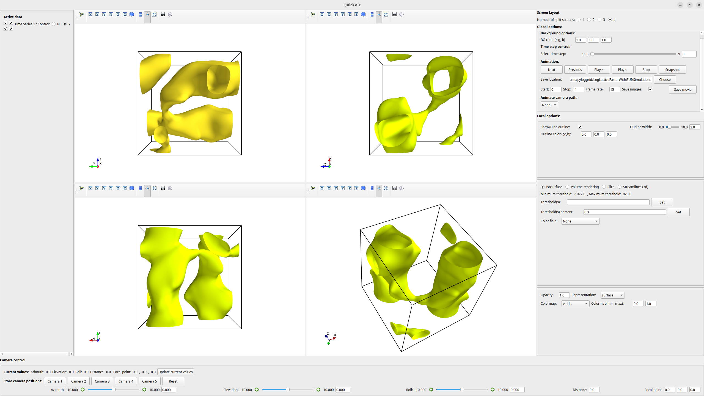

# A fast and lightweight visualization package

A different UI built for the [mayavi](https://docs.enthought.com/mayavi/mayavi/) python package with TraitsUI. It supports 3D time series scalar data (currently up to 4) and can currently visualize the following:

- Isosurfaces
- Volume rendering
- 2D slice (filled contours, streamlines with line integral convolution, vector slice)
- 3D streamlines

## Required packages

The following packages are necessary - mayavi, PyQt5, traitsui==7.4.3 (8 causes problems)

```
pip install mayavi PyQt5
pip install --upgrade traitsui==7.4.3
```

## UI

The UI allows you to split the screen up to a maximum of 4 panels, each with it's own view control. The panels on the left and right are resizable.



## Usage 

Documentation is being built with Sphinx and readthedocs and can be seen at https://quickviz.readthedocs.io/en/latest/. Some components may not work. 

## Known issues

The UI works reasonably well on Linux machines but the elements appear to be spaced out oddly on Mac OS.
Tested machines:

- Ubuntu 24.04
- Mac OS Sequoia
